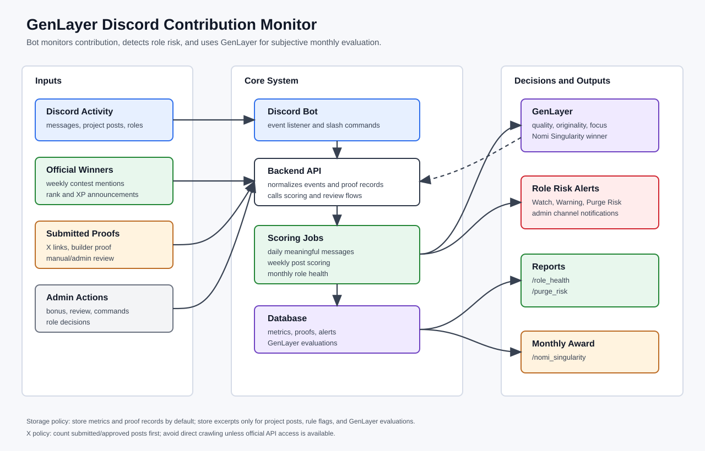
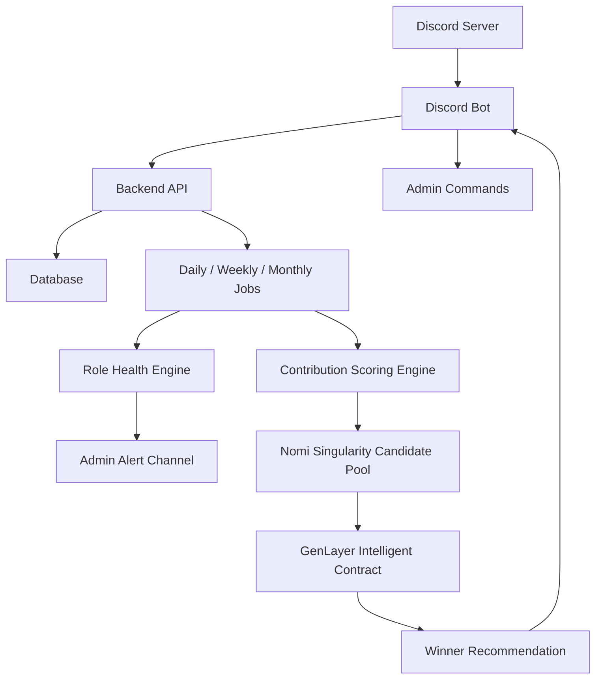

# GenLayer Discord Contribution Monitor

## 1. Goal

He thong nay giup admin theo doi do cong hien cua member theo thang, dua ra canh bao sap ha role, va de xuat 1 user xung dang cho `Nomi Singularity` khi admin go lenh `/nomi_singularity`.

Nguyen tac chinh:

- Bot khong can luu toan bo chat cua tung user.
- Backend luu metric, message id, proof link, excerpt can thiet, va moderation/contribution case.
- GenLayer khong giam sat realtime. GenLayer chi danh gia cac ho so da duoc backend tong hop.
- X contribution khong crawl truc tiep neu chua co API on dinh. User submit link, bot dem so bai nop, admin hoac GenLayer review khi can.



## 2. System Architecture



## 3. Main Responsibilities

### Discord Bot

- Listen message events in configured channels.
- Parse official contest winner messages.
- Receive slash commands from admins and members.
- Send role risk alerts to admin channels.
- Return `/nomi_singularity` result.

### Backend

- Normalize events from Discord.
- Calculate daily, weekly, and monthly metrics.
- Detect spam, low-effort activity, and rule risk.
- Store proof records for project posts, X links, and contest wins.
- Prepare candidate summaries for GenLayer.

### Database

Stores:

- User role snapshots.
- Daily activity metrics.
- Weekly content scores.
- Monthly role health status.
- X proof submissions.
- Official contest recognition.
- Rule violation cases.
- GenLayer evaluation results.

### GenLayer

GenLayer is used as an evaluation layer for subjective judgments:

- Is a post meaningful, original, and thoughtful?
- Is a candidate genuinely focused on GenLayer?
- Is a top candidate farming points?
- Which Brain user deserves Nomi Singularity for the month?

GenLayer should receive summaries, not full raw chat logs.

## 4. Role Rules Mapping

### Brain Role

Original conditions:

- Around 1 month of inactivity.
- Fewer than 100-150 meaningful messages within a month.
- Messages must reflect genuine engagement, not spam or low-effort activity.

System logic:

| Status | Condition |
| --- | --- |
| Healthy | `meaningful_messages >= 150`, low spam, active during the month |
| Watch | projected month-end meaningful messages below 150 |
| Warning | `100 <= meaningful_messages < 150` after most of the month passed |
| Purge Risk | `meaningful_messages < 100`, near 30 days inactive, or high spam ratio |

### Neurocreative Role

Original conditions:

- Fewer than 1 high-quality post within a month.
- Content must be original and thoughtful.
- No low-effort AI-generated posts.

System logic:

| Status | Condition |
| --- | --- |
| Healthy | at least 1 approved high-quality post in the month |
| Watch | no approved post yet, but month is still early |
| Warning | no approved post after week 3 |
| Purge Risk | no high-quality post by end of month |

Posts are tracked weekly, then rolled up monthly.

### Singularity Role

Original conditions:

- Loss of clear, consistent focus on GenLayer.
- Lack of visible engagement and contribution on both X and Discord.

System logic:

| Status | Condition |
| --- | --- |
| Healthy | strong GenLayer focus, Discord activity, and verified X contribution |
| Watch | one source is weak, for example Discord active but no X proof |
| Warning | weak GenLayer focus or missing X/Discord contribution late in month |
| Purge Risk | no clear GenLayer alignment and weak activity across both sources |

## 5. Contribution Sources

| Source | Automatic | Notes |
| --- | --- | --- |
| Discord meaningful messages | Yes | Counted from configured public channels |
| Discord project posts | Yes | Tracked weekly in configured channels |
| Official weekly contest winners | Yes | Parsed from official announcement/winner channels |
| X posts | Partial | User submits link; bot counts and admin/GenLayer verifies |
| GenLayer builder proof | Partial | User submits contract/GitHub/demo link |
| Admin recognition | Manual | Admin command adds trusted bonus |
| Rule violations | Yes/Manual | Bot flags, admin reviews |

## 6. Message Quality and Spam Detection

Backend should filter obvious low-quality messages before counting them as meaningful.

Meaningful message candidate:

- Length above configured minimum, for example 30 characters.
- Not only emoji, sticker, or short greeting.
- Not repeated from recent messages.
- Not sent during burst spam.
- In an allowed public channel.
- Related to the community, project, support, or discussion context.

Spam or low-effort signals:

- Many messages in a short window.
- Repeated or near-duplicate text.
- Generic replies like `gm`, `nice`, `thanks`, `lfg` with no context.
- Copy-paste content.
- Off-topic promotion or suspicious links.

Recommended caps:

- Normal message points should have a daily cap.
- Project post points should have a weekly cap.
- Duplicate messages/posts should not count.

## 7. Weekly Project Posts

Project posts are counted weekly but evaluated monthly for role health.

Example weekly record:

```json
{
  "user_id": "123",
  "week": "2026-W18",
  "submitted_posts": 2,
  "valid_posts": 1,
  "high_quality_posts": 1,
  "quality_score": 84,
  "source_channel_id": "456"
}
```

Recommended rules:

- Only count posts in whitelisted project/content channels.
- Minimum length, for example 300-500 characters.
- Maximum counted posts per user per week.
- Store message id and excerpt, not every chat message.
- Send top or suspicious posts to GenLayer for quality review.

## 8. X Contribution Handling

X is not reliable for free crawling/rendering. Use proof submission instead.

Member command:

```text
/submit_x_post url:https://x.com/username/status/123
```

Stored record:

```json
{
  "user_id": "123",
  "platform": "x",
  "url": "https://x.com/username/status/123",
  "month": "2026-05",
  "status": "pending",
  "points": 0
}
```

Admin review:

```text
/review_x_post action:approve points:30
/review_x_post action:reject reason:"duplicate or unrelated"
```

Suggested rules:

- Only accept `x.com` or `twitter.com` status URLs.
- Do not accept duplicate URLs.
- Each URL can belong to only one Discord user.
- Pending submissions do not count for Singularity health.
- Approved X post count is enough for early versions.

## 9. Official Weekly Contest Winner Parsing

If an official message mentions users and XP rewards, it should count as trusted recognition.

Example pattern:

```text
🥇 <@885076515929333823> & <@1193873947247267900> 5,000 XP
https://x.com/...
https://x.com/...
```

Rules:

- Only parse messages from whitelisted winner/announcement channels.
- Only parse messages from whitelisted admin/bot authors.
- Extract user mentions, rank, XP amount, source message id, and proof URLs.
- Do not use XP as direct contribution points. Map it to internal points.

Suggested mapping:

| Rank | External XP | Internal Points |
| --- | ---: | ---: |
| 1 | 5000 | 120 |
| 2 | 4500 | 100 |
| 3 | 4000 | 80 |
| Honorable | 3500 | 60 |
| Honorable | 3000 | 50 |

Stored record:

```json
{
  "user_id": "885076515929333823",
  "week": "2026-W18",
  "event_type": "neurocreative_challenge",
  "rank": 1,
  "external_xp": 5000,
  "contribution_points": 120,
  "source_message_id": "discord_message_id",
  "proof_urls": ["https://x.com/00adewale/status/2047585248918020399"]
}
```

This should count strongly for Neurocreative health and can also support `/nomi_singularity` if the user has Brain role.

## 10. Role Risk Alerting

Run a daily job to calculate risk for all tracked roles.

Risk levels:

| Level | Meaning |
| --- | --- |
| Healthy | User is on track |
| Watch | User may miss target if activity does not improve |
| Warning | User is likely to miss target |
| Purge Risk | User is close to failing role conditions |
| Critical | User is inactive or clearly fails role conditions |

Example admin alert:

```text
Role Risk Alert

User: @abc
Role: Brain
Status: Warning
Month: 2026-05

Current:
- Meaningful messages: 72 / 100 minimum
- Active days: 9
- Spam flags: 0
- GenLayer focus score: 61

Reason:
User may not meet Brain role activity requirement this month.

Suggested action:
Watch / Remind / No action
```

Suggested reminder timing:

- Day 10: light watch alert if projected below target.
- Day 20: warning alert.
- Last 5 days: purge risk alert.
- End of month: final role review report.

## 11. Nomi Singularity

`/nomi_singularity` selects one standout Brain user for the selected month.

Eligibility:

- User has Brain role.
- User is not in Purge Risk or Critical state.
- Meaningful messages are at least 100, preferably 150+.
- Spam and low-effort ratio are low.
- User has visible GenLayer alignment.
- Project post, contest win, builder proof, X proof, or admin bonus can improve ranking.

Backend flow:

```text
1. Admin runs /nomi_singularity month:2026-05
2. Backend filters users with Brain role
3. Backend excludes purge-risk users
4. Backend selects top 3-5 candidates
5. Backend sends candidate summaries to GenLayer
6. GenLayer returns 1 winner with reason and confidence
7. Bot posts recommendation to admin channel
```

Candidate payload:

```json
{
  "task": "select_nomi_singularity_winner",
  "month": "2026-05",
  "eligible_role": "Brain",
  "rules": [
    "genuine engagement",
    "no spam or low-effort farming",
    "clear GenLayer focus",
    "consistent contribution over the month"
  ],
  "candidates": [
    {
      "user_id": "123",
      "meaningful_messages": 164,
      "active_days": 25,
      "high_quality_posts": 2,
      "weekly_contest_points": 120,
      "x_approved_posts": 1,
      "genlayer_focus_score": 91,
      "spam_flags": 0,
      "admin_bonus": 30,
      "summary": "Consistent GenLayer discussions, original weekly posts, and visible X contribution."
    }
  ]
}
```

GenLayer expected result:

```json
{
  "winner_user_id": "123",
  "confidence": 0.91,
  "reason": "Most consistent meaningful engagement with clear GenLayer alignment and no spam indicators."
}
```

## 12. Suggested Database Tables

### users

```text
id
discord_user_id
display_name
created_at
updated_at
```

### user_role_snapshots

```text
id
user_id
role_name
captured_at
```

### daily_user_metrics

```text
id
user_id
date
valid_messages
meaningful_messages
low_effort_messages
spam_flags
active_minutes
genlayer_focus_score
```

### weekly_post_metrics

```text
id
user_id
week
submitted_posts
valid_posts
high_quality_posts
quality_score
points
```

### contribution_proofs

```text
id
user_id
source
url
message_id
channel_id
status
points
reviewed_by
created_at
reviewed_at
```

### contest_recognitions

```text
id
user_id
event_type
week
rank
external_xp
internal_points
source_message_id
proof_urls_json
created_at
```

### role_health_reports

```text
id
user_id
role_name
month
risk_level
reason
metrics_json
created_at
```

### genlayer_evaluations

```text
id
task_type
month
input_summary_json
result_json
confidence
created_at
```

## 13. Slash Commands

Admin commands:

```text
/role_health user:@abc month:2026-05
/purge_risk role:Brain month:2026-05
/purge_risk role:Neurocreative month:2026-05
/purge_risk role:Singularity month:2026-05
/nomi_singularity month:2026-05
/review_x_post action:approve points:30
/admin_bonus user:@abc points:30 reason:"Helpful GenLayer support"
/weekly_posts user:@abc
```

Member commands:

```text
/submit_x_post url:<x_status_url>
/submit_builder_proof url:<contract_or_github_or_demo_url>
/my_contribution month:2026-05
```

## 14. Privacy and Retention

Recommended approach:

- Do not store all raw chat by default.
- Store metrics for normal activity.
- Store message id and channel id for audit.
- Store excerpts only for project posts, rule flags, and GenLayer evaluations.
- Set retention windows for excerpts and moderation cases.
- Do not read or store DMs.
- Make admin-only reports private.

## 15. Implementation Phases

### Phase 1

- Discord bot event listener.
- Daily metrics.
- Brain meaningful message tracking.
- Weekly project post tracking.
- Manual X submission.
- Basic role risk alerts.

### Phase 2

- Official weekly contest winner parser.
- Neurocreative and Singularity health reports.
- Admin review commands.
- Monthly `/nomi_singularity` without GenLayer, using backend scoring.

### Phase 3

- GenLayer evaluation for top candidates.
- GenLayer post quality review.
- Builder proof verification.
- Final monthly role review report.

## 16. References

- GenLayer contribution/announcement context: https://t.me/s/genlayerofficial?before=48
- X API docs: https://docs.x.com/x-api
- X API rate limits: https://docs.x.com/x-api/fundamentals/rate-limits
- X developer guidelines: https://docs.x.com/developer-guidelines

